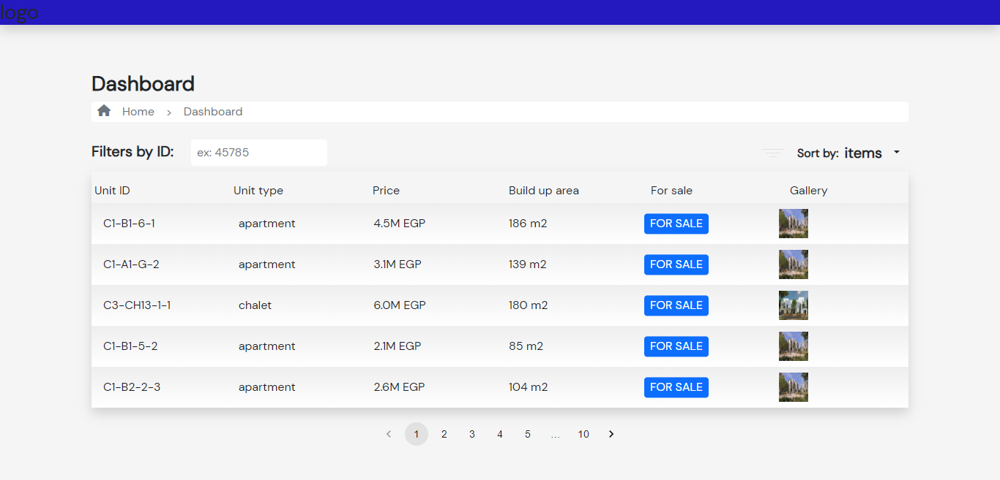
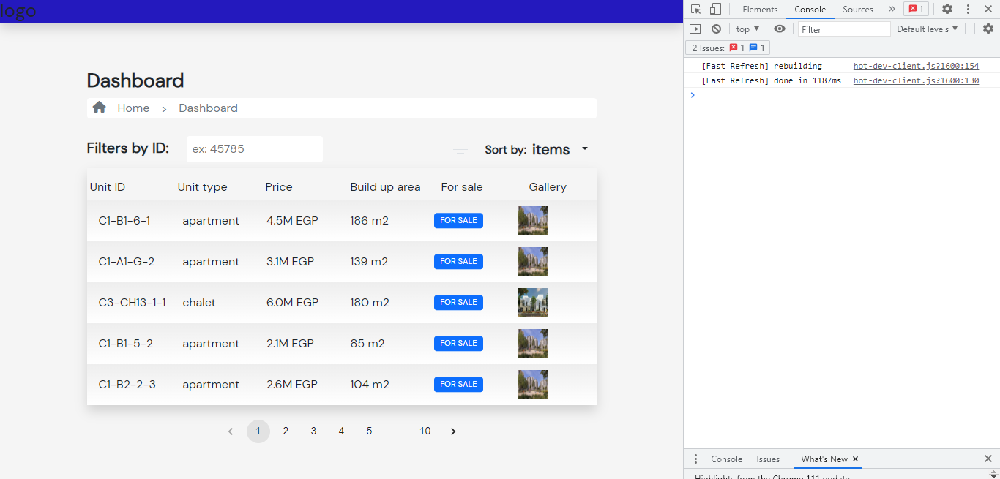
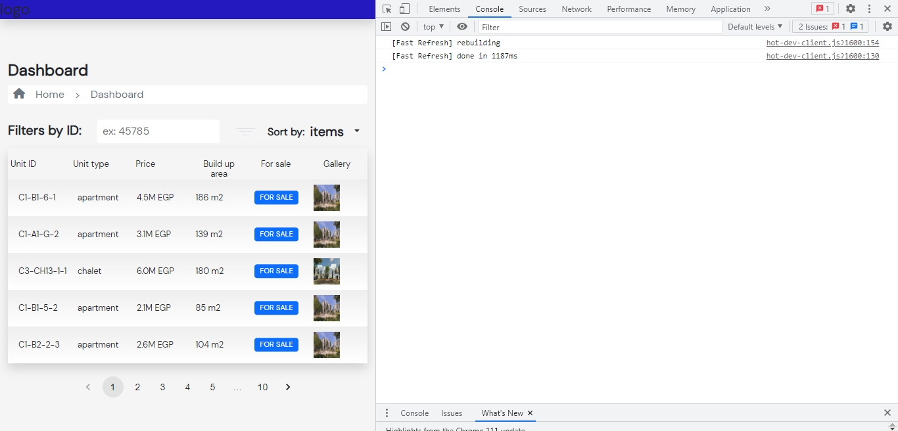

# Unit Table

This page displays a table of units, with pagination, sorting, and search functionality. Clicking on the image in the gallery column opens a lightbox with all the images for that unit.

## Design

The design of this page is responsive and will adapt to various screen sizes.

## Functionality

### Pagination

The table supports pagination, displaying a maximum of 10 units per page. Use the page navigation buttons at the bottom of the table to navigate between pages.

### Sorting

The table can be sorted by any column by clicking on the column header. Clicking the same header again will reverse the sort order.

### Searching

The table supports searching by unit id. Enter a unit id in the search box above the table to filter the table by unit id.

### Gallery Lightbox

Clicking on the image in the gallery column will open a lightbox displaying all the images for that unit.

## Unit Tests
The following unit tests have been implemented:

Pagination: Verify that the table displays a maximum of 10 units per page, and that the page navigation buttons correctly navigate between pages.
Sorting: Verify that the table can be sorted by any column, and that clicking the same header again will reverse the sort order.
Searching: Verify that entering a unit id in the search box filters the table by unit id.
Gallery Lightbox: Verify that clicking on the image in the gallery column opens a lightbox displaying all the images for that unit.

## Responsive Design

The design of this page is responsive, adapting to various screen sizes. On smaller screens, the table columns stack vertically and the navigation buttons are displayed below the table.

